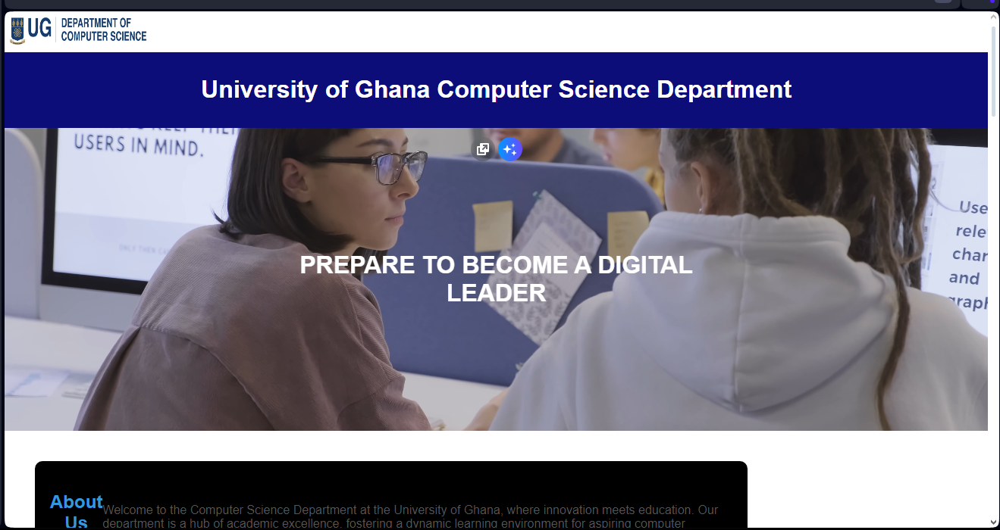
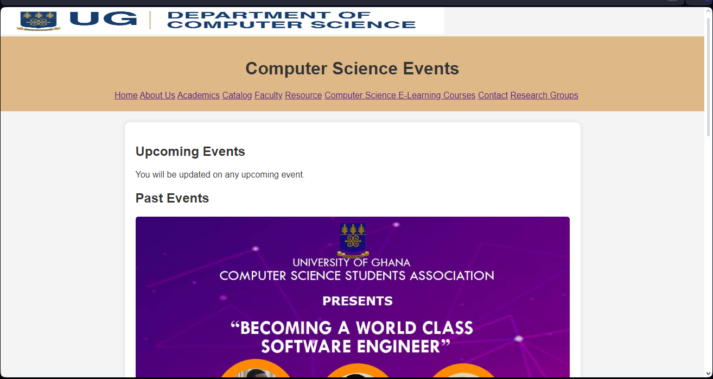

# DCIT_205_IA

Student_ID-11356687
Name:ABIGAIL DODD

## INTRODUCTION

   Greetings from the University of Ghana Department of Computer Science's official repository. This project is an extensive web solution I created with HTML, CSS, and JavaScript`` to improve the department's online visibility. This website, which has ten pages, is meant to be an interactive and interesting resource for visitors, teachers, and students.

## PURPOSE

### The goal of this project is to give the University of Ghana's Department of Computer Science a visually appealing and user-friendly digital space. The website provides vital information about the department's programs, academic calendar, faculty profiles, and research projects through thoughtfully designed HTML structures, responsive CSS layouts, and interactive JavaScript features

## Clone and set up the project

   1 Clone the Repository

* Open your terminal or command prompt.
* Navigate to the directory where you want to clone the project.
* Run the following command to clone the repository:
* git clone <https://github.com/put-username> here/UGcomputer-science-website.git

### 2 Navigate to the project Directory

* cd UG computer-science-website___using git bash

#### 3 Open in your prefered code editor

* code . ___using git bash

#### 4 Explore the project structure

* example `Img/:holds the images i used in the project.

#### 5 Run Locally

          * Open the Homepage.html file
          * * Right click and choose your browser
          * make changes if needed

#### 6 Commit your changes

            * git add .
            * git commit -m" Describe the changes made"
            * git push origin main
              #### 7 Hosting

### Lesson learned

Integration of Technologies:

The project demonstrates the integration of multiple technologies, including HTML, CSS, and JavaScript. Understanding how these technologies work together is crucial for building modern and interactive web applications.

### Screenshots

!

